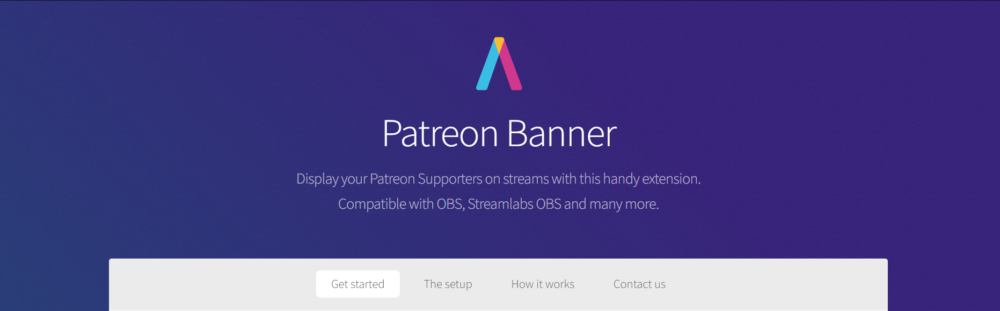

> This is an offline modified version of what was available on [patreonbanner.com](https://patreonbanner.com). The source code for the original project can be found [here](https://github.com/AssistantApps/Patreon-Banner)

### How to use this version

- Download the files from the [releases section](https://github.com/AssistantApps/PatreonBannerOffline/releases)
- Place them in a safe location on your machine that has StreamLabs (or whatever you use to stream)
- Rename "patreonConfig.json.template" to "patreonConfig.json"
  - Edit the content of this file to contain your Patreon supporters and tweak the display settings in here
- In StreamLabs create a a new "Browser Source",
  - Give it any name
  - Enable "Local file"
  - Select the "index.html" file in the folder you stored in a safe place (you did put the files in a safe place right?)
  - You should see you Patreon supporters moving in the preview

> If you edit the the "patreonConfig.json" file, you will need to click the "refresh cache of the current page" button in the browser source you create before you can see the changes reflected on StreamLabs
